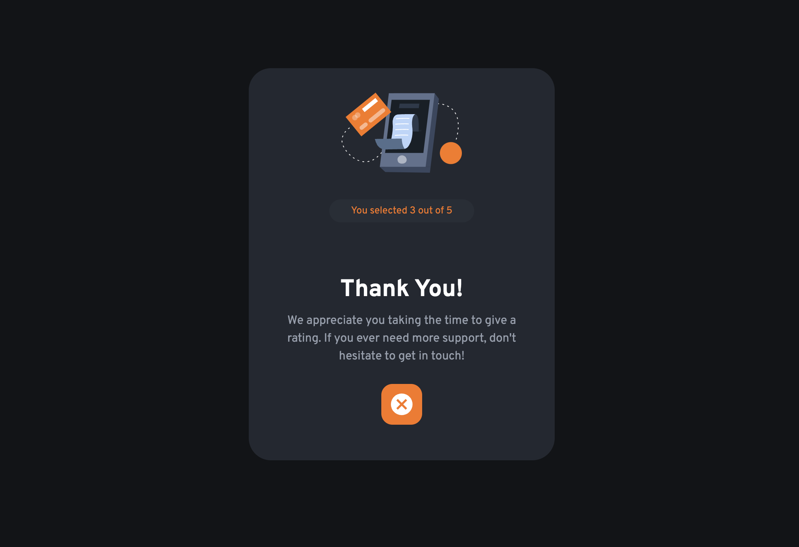

# Interactive Rating Component

This is a project created as a solution to the "Interactive Rating Component" challenge from [Frontend Mentor](https://www.frontendmentor.io/challenges/interactive-rating-component-koxpeBUmI). The goal of the challenge was to build an interactive rating component and make it look as close to the design as possible.

## Overview

This project implements an interactive rating component where users can select a rating from 1 to 5 and submit their choice. After submitting, a "Thank You" card is displayed, acknowledging the user's selection. Additionally, the project includes hover and focus states for all interactive elements.

## Features

- Users can select a rating from 1 to 5 by clicking on the corresponding button.
- After selecting a rating and clicking the submit button, a "Thank You" card is displayed with the selected rating.
- The project includes hover and focus states for interactive elements to enhance the user experience.

## Additional Implementation

In addition to the main features required by the challenge, the project also implements the following:

- **Modal Component**: A modal component is used to display the "Thank You" card after submitting a rating.
- **Closing Modal**: Users can close the modal by clicking the close button, allowing them to return to the rating selection interface.

## Technologies Used

- React.js: A JavaScript library for building user interfaces.
- Material-UI: A popular React UI framework for building responsive and customizable components.
- HTML/CSS: Markup and styling languages for structuring and designing the user interface.

## Installation and Usage

To run this project locally, follow these steps:

1. Clone the repository: `git clone https://github.com/VictorKevz/rating-component.git`
2. Navigate to the project directory: `cd rating-component`
3. Install dependencies: `npm install`
4. Start the development server: `npm start`
5. Open your browser and go to `http://localhost:3000` to view the application.

## Links

- [Repository Link](https://github.com/VictorKevz/rating-component)
- [Frontend Mentor Challenge Link](https://www.frontendmentor.io/challenges/interactive-rating-component-koxpeBUmI)

## Author

This project was created by [Victor.Kevz](https://github.com/VictorKevz) as a solution to the Frontend Mentor challenge. Feel free to contact me or contribute to the project by submitting issues or pull requests. Thank you for checking out my project!